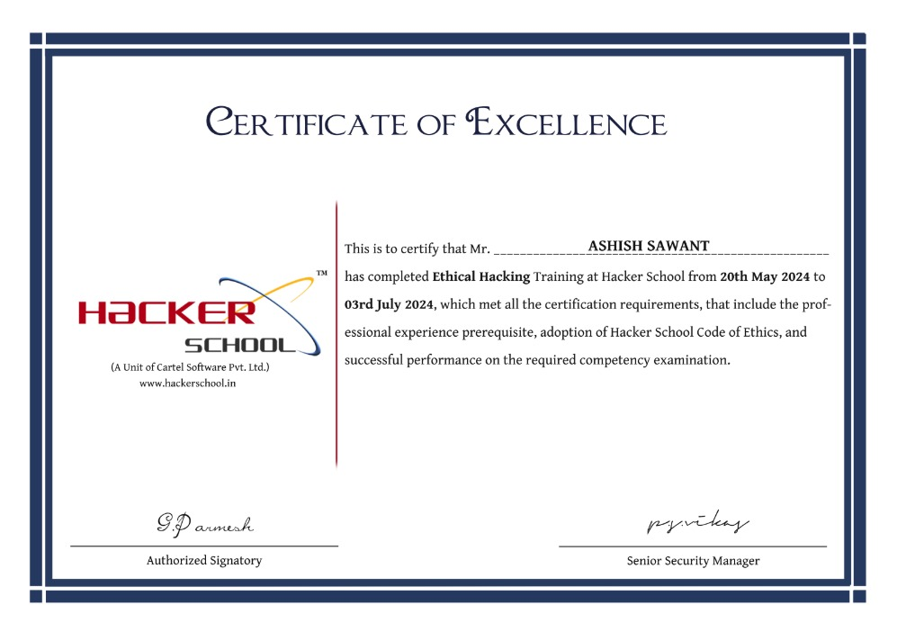
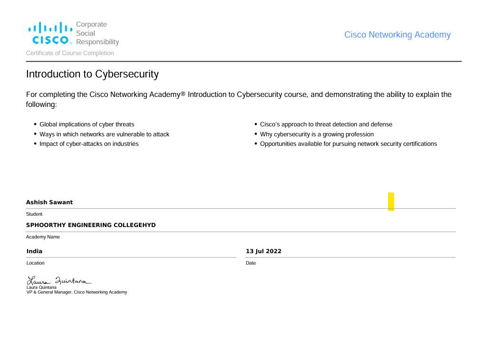

# 📜 Certifications

---

## 🛡️ Ethical Hacking Training – Hacker School

**Duration:** 20th May 2024 – 03rd July 2024  
**Issued By:** Hacker School (A Unit of Cartel Software Pvt. Ltd.)  
**Verified By:** G.P. Darnesh (Authorized Signatory), P.S. Vikas (Senior Security Manager)

### ✅ Skills & Topics Covered:
- Penetration Testing
- Vulnerability Assessment
- Intrusion Detection & Prevention
- Threat Analysis & Ethical Hacking Fundamentals
- Hacker Code of Ethics & Compliance

### 📄 Certificate:

---

## 🌐 Introduction to Cybersecurity – Cisco Networking Academy

**Completed On:** 13 July 2022  
**Issued By:** Cisco Networking Academy  
**Institution:** Sphoorthy Engineering College, Hyderabad  
**Location:** India

### ✅ Topics Covered:
- Global implications of cyber threats
- Network vulnerabilities and attack methods
- Cyber-attack impact on industries
- Cisco’s approach to threat detection and defense
- Cybersecurity as a career path
- Network security certification opportunities

### 📄 Certificate:

---

### 🔗 Contact:

- **Email**: aaashi0301@gmail.com  
- **LinkedIn**: [Ashish Sawant](https://www.linkedin.com/in/ashish-sawant-a02412260)
